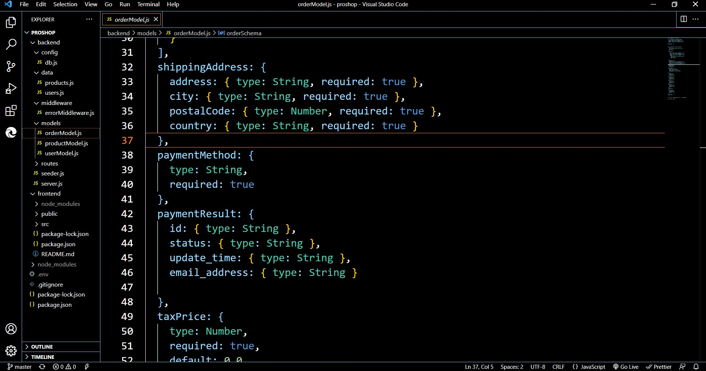

# proshop
## MERN Tutorial eCommerce Project ( In Development )

**Technologies Learned So Far:**  
1. Frontend  
  * ReactJS  
  * React-Bootstrap (Will rework with Material UI)
  * React-Router-Bootstrap
  * React-Redux
  * React-Router-Dom
  * * Axios 
2. Backend 
  * NodeJS  
  * Mongoose/MongoDB  
  * Express  
  * ExpressAsyncHandler
  * BCryptJS  
  * Dotenv   
3. Misc.
  * Colors (All the way back to colors!)  
  * Git (Version Control)

